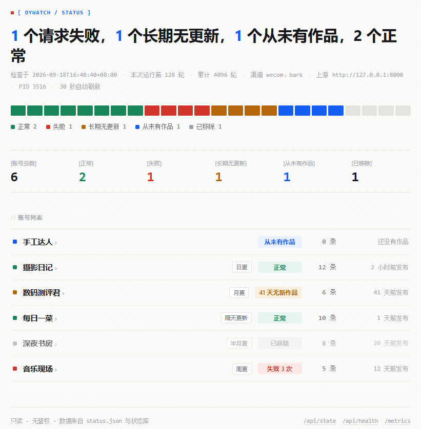
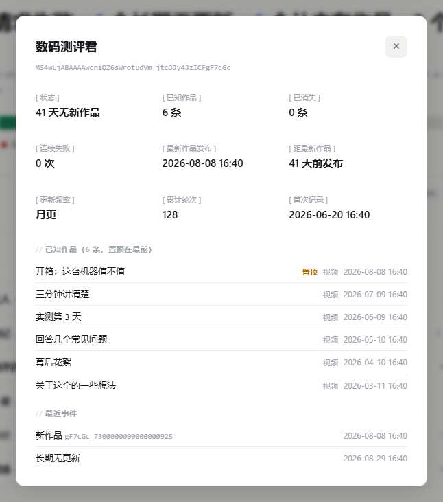

# dywatch —— 抖音账号视频监控

监控多个抖音账号，检测**新作品**与**作品消失**，通过钉钉 / 企业微信 / Bark / Server 酱 /
Telegram / 通用 webhook 推送通知。它建立在
[Douyin_TikTok_Download_API](https://github.com/Evil0ctal/Douyin_TikTok_Download_API) **v5** 之上，
但只做一件事：**盯着数据变没变**。

> **完整文档：<https://dywatch.yunov.top>**
> 配置项、判定规则、容量估算、升级与排障的细则都在文档站，
> 下面每一处需要展开的地方都给了直达链接；文末还有一张「接下来看哪里」的索引。

```
      抖音  ←—— 签名 / 身份池 / 调度器 / 熔断 / 归档 ——  DTK v5
                                                          ↑
                                        HTTP /api/v1（默认只读，一个 API Key）
                                                          ↓
                                   dywatch  ←—— 判定 → 通知 → 面板
```

**本工具不自带签名、不碰 Cookie、不碰身份池、不直接访问抖音。** 抓取、风控绕行、身份轮换
全部由 DTK v5 负责；dywatch 对 DTK **默认是纯只读的**（不提交任务、不改设置、不注册
watchlist），所以只需要两个 scope，也不会把 DTK 实例搞坏。唯一的例外是一个**默认关闭**的开关：
打开 `ARCHIVE_DOWNLOAD_ENABLED` 后会请求 DTK 把新作品的媒体存一份，那需要额外授
`media:write`（见 [归档下载](https://dywatch.yunov.top/guide/archive-download)）。

**部署形态只有一种：Ubuntu / Linux 服务器上的 systemd 服务。** 不提供容器镜像——这个工具就是
一个进程 + 一个 SQLite 文件 + 一份配置，systemd 已经把该管的（开机自启、崩溃重启、日志归集、
权限隔离）管完了，再加一层编排只会多一处要维护的东西。

## 目录

- [快速开始（Ubuntu）](#快速开始ubuntu)
  - [1. 前置：DTK v5 实例 + 一把 API Key](#1-前置dtk-v5-实例--一把-api-key)
  - [2. 安装](#2-安装)
  - [3. 升级（这一步最容易做错）](#3-升级这一步最容易做错)
- [常用命令](#常用命令)
- [面板](#面板)
- [接下来看哪里](#接下来看哪里)

---

## 快速开始（Ubuntu）

### 1. 前置：DTK v5 实例 + 一把 API Key

**DTK 本身怎么部署，以上游文档为准**——本仓库不复制那些步骤（复制过来就会过期）：
[官方 Quick start](https://douyin.wtf/quickstart/)（从零跑起来、初始化向导、第一把 Key）、
[GitHub 仓库](https://github.com/Evil0ctal/Douyin_TikTok_Download_API)（源码 / 镜像 / 反馈）。

dywatch 侧只有两件事要确认：

1. **身份池不能是空的。** 池子空着时所有请求会一直报 `503 IDENTITY_POOL_EXHAUSTED`，
   与 Key、scope 都无关。补池子的两条路见官方
   [Step 3](https://douyin.wtf/quickstart/#step-3--decide-about-the-browser-container)。
2. **一把 Key、两个 scope。** 控制台 **API keys → Create key**，勾下面两个就够
   （`viewer` 账号看不到入口，用初始化向导建的管理员账号来建；Key 建好后只按自身 scope 鉴权）：

| scope          | 用途                                               |
| -------------- | -------------------------------------------------- |
| `douyin:read`  | 读作者作品列表（主抓手）、识别分享链接、读任务结果 |
| `archive:read` | 读本地归档，做删除交叉确认（零身份成本）           |

Key 形态是 `dtk_<12位十六进制>_<32位base64url>`（共 49 字符），**完整值只在创建时显示一次**。

后续要开[归档下载](https://dywatch.yunov.top/guide/archive-download)再加 `media:write`；
其余细节（角色与 scope 的关系、Key 怎么验证）见
[前置：DTK v5 与 API Key](https://dywatch.yunov.top/guide/dtk-setup)。

### 2. 安装

**Python 必须 ≥ 3.11**（Ubuntu 24.04 自带 3.12 够用，22.04 自带的 3.10 不够）。
`install.sh` 会自己在 `python3.14 / 3.13 / 3.12 / 3.11 / python3` 里挑版本最高的一个，
也可以用 `PYTHON=/usr/bin/python3.12` 显式指定。

```bash
sudo apt update && sudo apt install -y python3 python3-venv   # 版本不够时先装一个 3.11+
git clone <本仓库> && cd douyin-monitor
sudo bash deploy/install.sh      # 建 .venv、装 systemd 单元与日志轮转 cron、生成配置模板

vi /opt/douyin-monitor/.env          # 填 DTK_API_KEY（要用通知就一并填渠道）
vi /opt/douyin-monitor/users.conf    # 填要监控的账号

cd /opt/douyin-monitor
./.venv/bin/python -m dywatch doctor          # 自检：实例可达 / Key 有效 / scope 够用 / 账号读得出来
./.venv/bin/python -m dywatch once            # 只跑一轮，确认配置真的对
sudo systemctl enable --now dywatch           # 常驻
journalctl -u dywatch -f
```

`install.sh` 首次安装只做准备、**不替你填 API Key**（凭据不该由脚本猜）。它**不创建专用系统
用户**：服务以"执行安装的那个账号"身份运行（`sudo` 时取 `SUDO_USER`），所以上面的 `vi`、
`doctor`、`once` 都用你自己的账号，不需要 `sudo -u` 来回切；权限边界由 systemd 单元里的
`ProtectSystem=strict` + `ReadWritePaths` 给出，不靠换用户。装到别的目录：
`sudo MONITOR_HOME=/srv/dywatch bash deploy/install.sh`。

`DTK_API_KEY` 留空时进程会直接以退出码 2 结束，systemd 单元配了
`RestartPreventExitStatus=2`，所以不会陷入"每 10 秒重启一次、日志刷屏"的死循环。

### 3. 升级（这一步最容易做错）

```bash
cd /opt/douyin-monitor
git fetch origin && git reset --hard origin/main   # 不要用 git pull：历史被改写过，会因 divergent branches 直接失败
sudo bash deploy/install.sh --yes                  # 必须重跑：.venv 里装的是复制进去的代码
```

`.venv` 是**非可编辑安装**（代码被复制进 `site-packages`），所以只 `git reset --hard` +
`systemctl restart` **不会**让新代码生效。`--check` 只体检不改动。完整说明（`rsync` 分支、
日志轮转配置迁移、`--yes` 的用法）见
[升级](https://dywatch.yunov.top/operations/upgrade)。

---

## 常用命令

```bash
./.venv/bin/python -m dywatch                # 常驻监控（systemd 用的就是这一条）
./.venv/bin/python -m dywatch once           # 只跑一轮后退出：上线前确认配置是否正确
./.venv/bin/python -m dywatch doctor         # 自检：实例可达 / Key 有效 / scope 够用 / 账号读得出来
./.venv/bin/python -m dywatch status         # 打印最近一轮的状态快照
./.venv/bin/python -m dywatch config-check   # 打印全部生效配置与每一项的来源
./.venv/bin/python -m dywatch add "<主页链接或 sec_user_id>" [昵称]
./.venv/bin/python -m dywatch test-notify    # 给每个渠道发一条测试消息
```

前缀写成 `./.venv/bin/python -m` 是为了"在安装目录里、不进虚拟环境也能直接抄着跑"；
`source .venv/bin/activate` 之后可以简写成 `dywatch doctor`。命令都接受
`--env /path/to/.env`。**先跑 `doctor`**：它把"配错了"和"上游坏了"分开，这两类的处理方式完全不同。
每个账号一轮消耗 1 个身份，属正常开销。逐条说明见
[命令行](https://dywatch.yunov.top/guide/commands)。

**改 `users.conf` 不用重启**（按 mtime 热加载，下一轮自动生效）；改 `.env` 必须
`systemctl restart dywatch`。

---

## 面板

`.env` 里 `WEB_ENABLED=true` 打开，默认只听回环：`http://127.0.0.1:8787/`。
面板**只读、无鉴权、不发任何上游请求**——列表读 `data/status.json`（每轮写一次的快照），
详情读状态库，所以打开它不消耗身份、不会触发风控。要对外暴露请自己加反代鉴权。



一屏看完"每个账号现在怎么样"：LED 状态阵列（正常 / 失败 / 长期无更新 / 从未有作品 / 已移除）、
数据条、账号列表（状态徽章、更新频率、已知作品数、距最新作品发布多久）。



点任意一行打开详情：作品（置顶的排最前）、已消失作品、最近事件、更新频率与累计轮次。
顺带提供机器接口：`/api/state`、`/api/health`、`/api/user/<sec_user_id>`、`/metrics`（Prometheus）、
`/healthz` `/readyz`。读法与移动端布局见 [只读面板](https://dywatch.yunov.top/guide/dashboard)。

---

## 接下来看哪里

| 想做的事                                       | 文档                                                              |
| ---------------------------------------------- | ----------------------------------------------------------------- |
| 这个工具是什么、和 DTK v5 怎么分工、边界在哪   | [这是什么](https://dywatch.yunov.top/guide/what-is-dywatch)       |
| **把 DTK v5 部署起来（上游官方文档）**         | [官方 Quick start](https://douyin.wtf/quickstart/) · [GitHub](https://github.com/Evil0ctal/Douyin_TikTok_Download_API) |
| dywatch 只要哪两个 scope、身份池为什么不能空   | [前置：DTK v5 与 API Key](https://dywatch.yunov.top/guide/dtk-setup) |
| 完整安装 / 卸载 / 首次配置                     | [安装 dywatch](https://dywatch.yunov.top/guide/quick-start)       |
| 查某个命令怎么用                               | [命令行](https://dywatch.yunov.top/guide/commands)                |
| 加账号、改昵称、粘主页链接                     | [监控列表 users.conf](https://dywatch.yunov.top/guide/users-conf) |
| 看面板每个读数是什么意思                       | [只读面板](https://dywatch.yunov.top/guide/dashboard)             |
| **查某个配置项的默认值与含义（全部 50 项）**   | [配置参考](https://dywatch.yunov.top/config/reference)            |
| 估机器、网络与磁盘够不够                       | [容量估算](https://dywatch.yunov.top/config/capacity)             |
| 搞清"新作品 / 作品消失 / 漏检 / ID 写错"怎么判 | [判定规则](https://dywatch.yunov.top/guide/detection-rules)       |
| 15 种事件分别是什么意思、哪种会推送            | [事件类型](https://dywatch.yunov.top/reference/events)            |
| 开归档下载（作品下架前留一份证据）             | [归档下载](https://dywatch.yunov.top/guide/archive-download)      |
| 给 Key 授权、申请 `media:write`                | [权限 / API Key](https://dywatch.yunov.top/reference/permissions) |
| 升级到新版本                                   | [升级](https://dywatch.yunov.top/operations/upgrade)              |
| 日志在哪、怎么轮转、为什么不用系统 logrotate   | [日志与轮转](https://dywatch.yunov.top/operations/logging)        |
| 报错了 / 收不到通知 / 面板打不开               | [排障](https://dywatch.yunov.top/operations/troubleshooting)      |
| 看代码怎么组织的、依赖方向                     | [架构总览](https://dywatch.yunov.top/guide/architecture)          |

设计取舍、每条规则的来历、以及"为什么不那样做"，都在 [`DESIGN.md`](./DESIGN.md) 里；
真实接口契约（含实测数据）在它的第 2 章。
